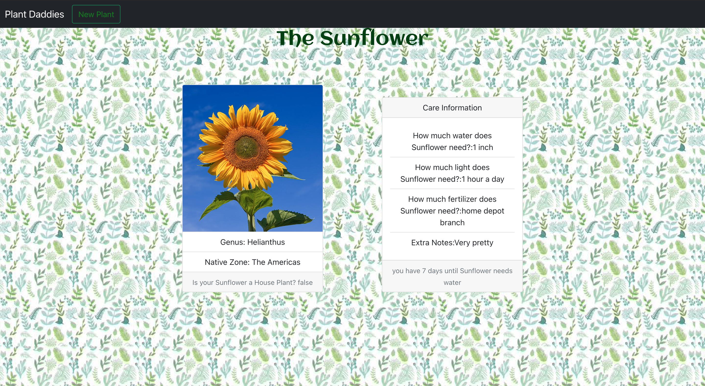

# PlantDaddy

PlantDaddy is the perfect app(le) for any aspiring gardener. This top of the vine website allows it's users to log a plant into our database, and customize its pear. With added features such as a timer telling you when should water your plant and an easy to read layout. PlantDaddy is the site for you

### Wireframes

	

### Technology

- React
- Express
- Mogoose/MongoDB
- Axios
- Method-override
- Cors
- Bootstrap
- Heroku
- Cors

### mvp
- User should be able to Create a plant
- User should be able to Read a plant
- User should be able to Update a plant
- User should be able to Delete a plant
- Master git work flow

### stretch goals
- N/A
- ToDo list

### roadblocks
- Delete Button - page would not refresh after deleting a plant
- Lost a team member halfway through

### final thoughts
- Groups that are made ideally should be in the same time zone.
